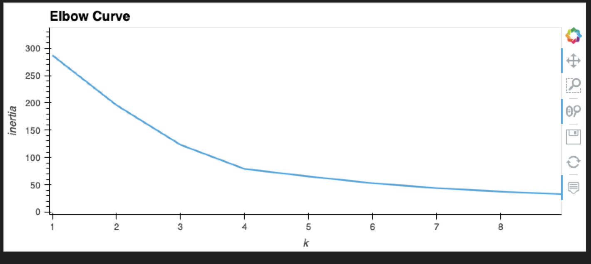
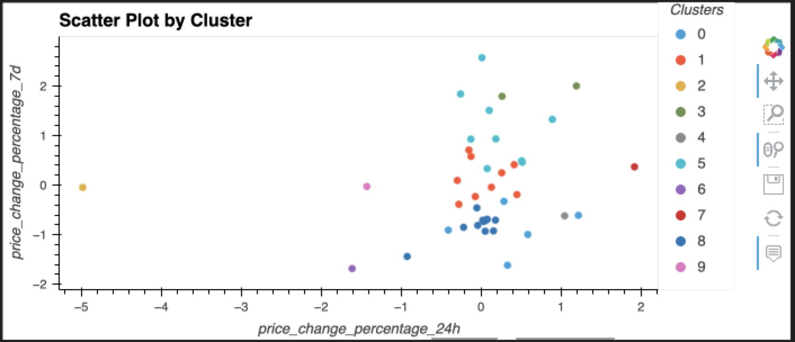
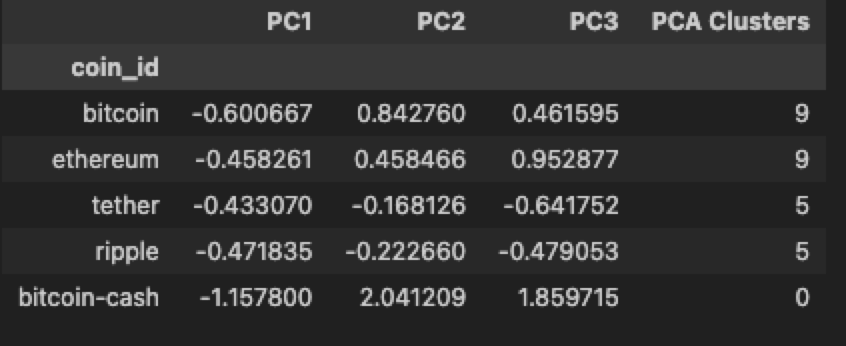
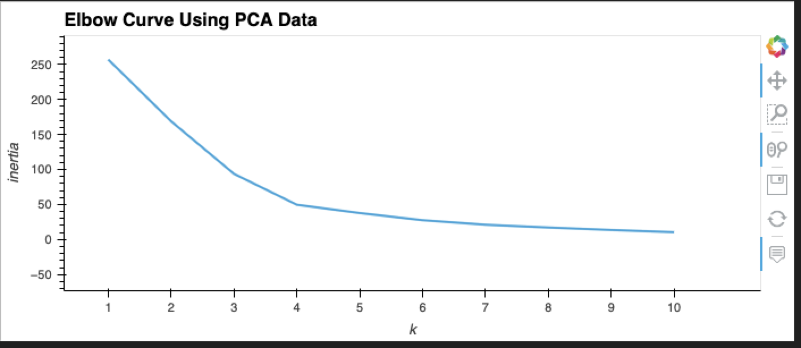
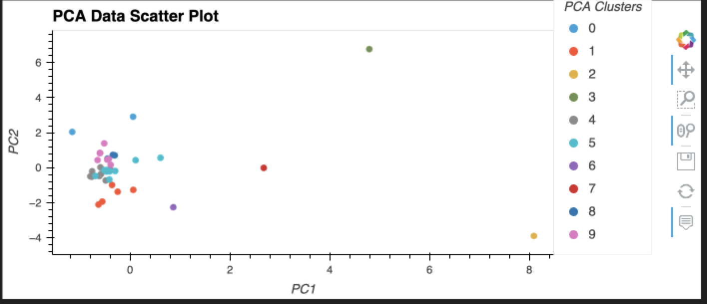

# CryptoClustering

*Description:*
For this challenge, Python and unsupervised learning methods were used to predict if cryptocurrencies are affected by 24-hour or 7-day price changes.

*Steps:*
1. Preparing the Data:
    A. Used the StandardScaler() module tol normalize the data from the CSV file.
    B. Created a DataFrame with the scaled data and set the coin_id as the index for the new DataFrame

2. Finding the Best Value for k Using the Original Scaled DataFrame, Using the Elbow Method:
    A. Created a list with the number of k values from 1 to 11
    B. Created an empty list to store the inertia values
    C. Created a `for` loop to compute the inertia with each possible value of k
    D. Created a dictionary with the data to plot the elbow curve
    E. Plotted a line chart with all the inertia values computed with the different k values to visually identify the optimal value for k

    

3. Cluster Cryptocurrencies with K-means Using the Original Scaled Data:
    A. Initialized the K-means model with the best value for k
    B. Fit the K-means model using the original scaled DataFrame
    C. Predicted the clusters to group the cryptocurrencies using the original scaled DataFrame
    D. Created a copy of the original data to add the new column with the predicted clusters
    E. Created a scatter plot using hvPlot with the following parameters:
        x-axis = PC1
        y-axis = PC2

    

4. Optimized Clusters with PCA (Principal Component Analysis)
    A. Performed a PCA on the original DataFrame to reduce the features to 3 principal components 
    B. Retrieved the explained variance to determine 
    C. Created a new DataFrame with the PCA data

    

5. Find the Best Value for K Using the PCA Data, Using the elbow method
    A. Created a list with the number of k values from 1 to 11
    B. Created an empty list to store the inertia values
    C. Created a `for` loop to compute the inertia with each possible value of k
    D. Created a dictionary with the data to plot the elbow curve
    E. Plotted a line chart with all the inertia values computed with the different k values to visually identify the optimal value for k

    

6. Cluster Cryptocurrencies with K-means Using the PCA Data
    A. Initialized the K-means model with the best value for k
    B. Fit the K-means model using the PCA data
    C. Predicted the clusters to group the cryptocurrencies using the PCA data
    D. Created a copy of the PCA DataFrame to add the new column with the predicted clusters
    E. Created a scatter plot using hvPlot with the following parameters:
        x-axis = price_change_percentage_24h
        y-axis = price_change_percentage_7d

    